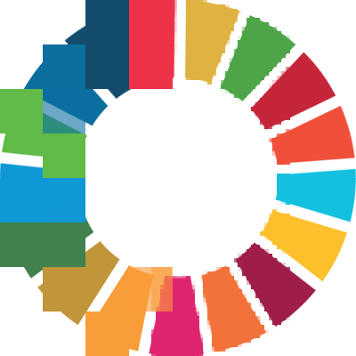

# Sustainable Digitalization - A primer

This repository contains the materials for the course Sustainable Digitalization offered as part of the Digital Society Initiative (DSI) PhD excellence program at the University of Zürich in 2023.

## Slides

| Lecture                | Slides                                    |
|------------------------|-------------------------------------------|
| Day 1 | [Slides Day 1](./slides/slides_day1.html) |
| Day 2 | [Slides Day 2](./slides/slides_day2.html) |

## Materials

Course content and links to all/ further reading materials can be found under: 

https://marioangst.github.io/susdigi_course/

